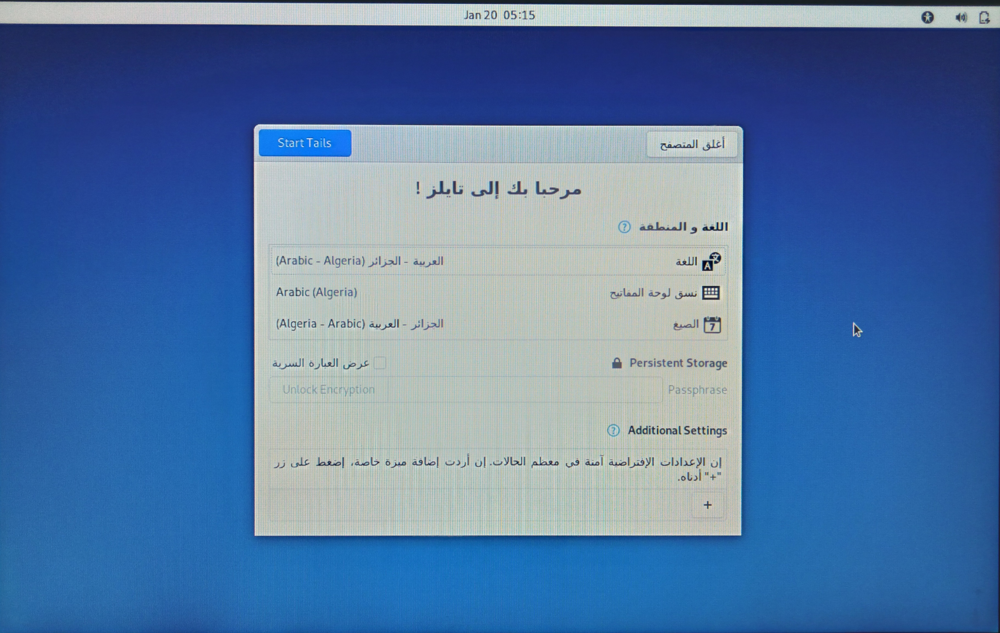
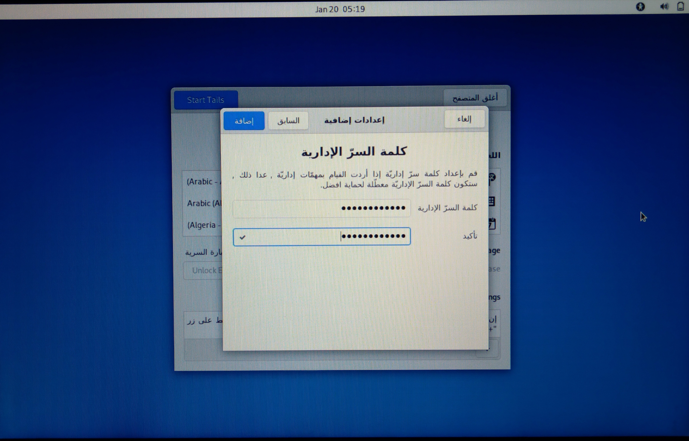
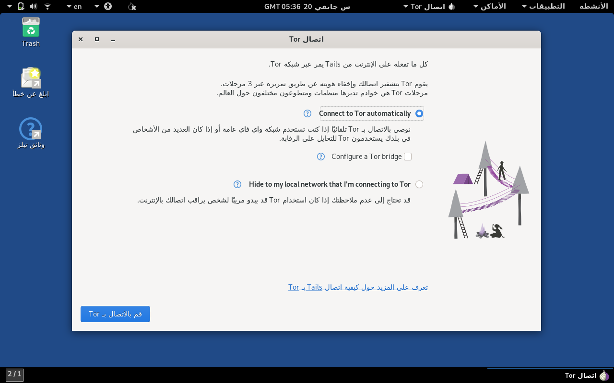
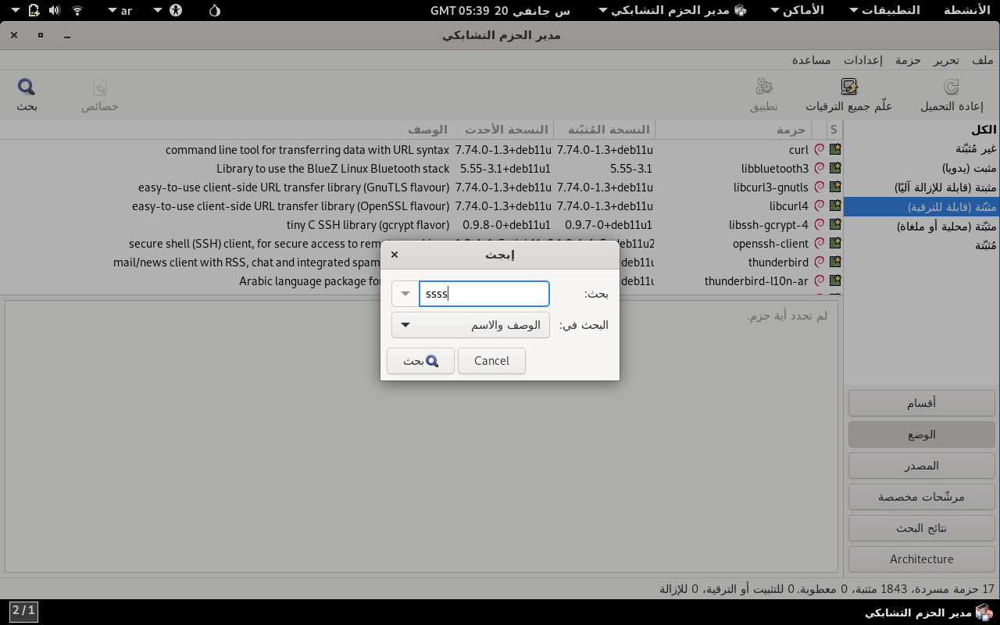
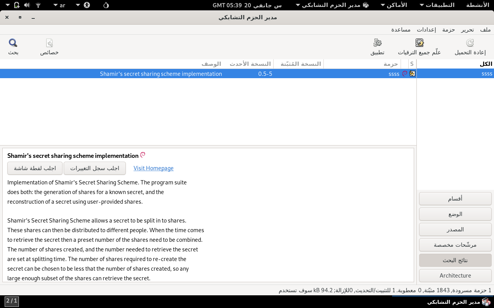
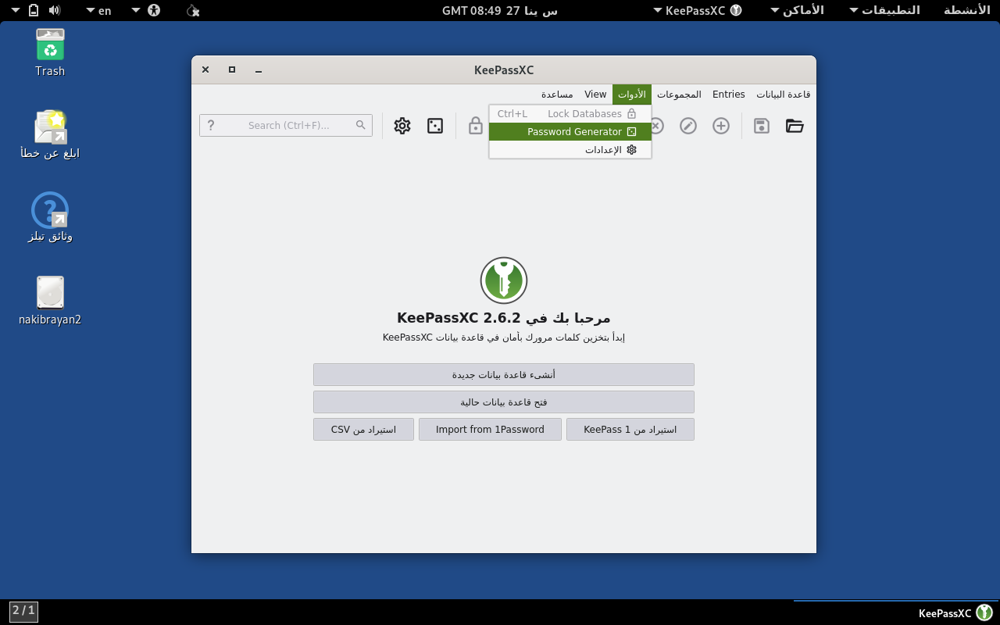
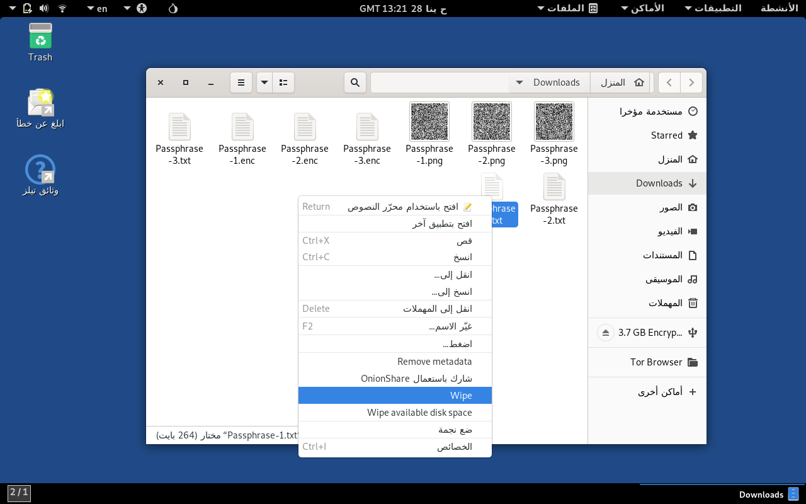

+++
title = "كيف تحفظ سر في الورق بطريقة أمنة"
date = 2024-02-09
description = """
في هذا المقال أشرح طريقة لتخزين سر في ورقة بطريقة أمنة حيث لايسطيع أي أحد معرفة السر
بمجرد قرائته للورقة. وسأقوم بذلك بإستعمال خوارزمية شامير لمشاركة الأسرار لتقسيم السر إلى
عدة أجزاء ثم تعمية كل جزء بخوارزمية التجزئة الآمنة-٢.
"""
tags =  [ "نُسخ_احتياطية", "تعمية", "دليل" ]
toc = true
url = "blog/كيف_تحفظ_سر_في_الورق_بطريقة_أمنة"
+++

للذهاب إلى الدليل مباشرة اضغط [هنا](#أنشئ-النسخة-الاحتياطية).

## مقدمة

كل واحد لديه معلومات سرية، منها البيانات اللازمة للولوج على حسابات في الإنترنت، العبارة
السرية لمُدير كلمات السّر، أرقام الحسابات المصرفية، معلومات الضرائب والتأمين والضمان
الاجتماعي، الرمز التذكُري (mnemonic) لمحفظة بيتكوين وأي بيانات أخرى حيوية في العالم
الرقمي وكذلك في العالم الحقيقي.

ولا يمكننا تحمل خصارة فقدان هذه المعلومات السرية، لذلك علينا نسخها احتياطيا. قد يلجئ
البعض إلى كتابة هذه الأسرار في حاسوبه الشخصي لكن هذا خطير جدا، ففي حالة اختُرق
الحاسوب سيحصل المخترقين على السر وهذا أمر سيئ. أما البعض الأخر سيكتبون السر على ورقة،
 هذه الطريقة أكثر أمانا من تخزين السر في حاسوب متصل بالشبكة لكنها ليست بلا عيوب، فأي
 شخص كان سارق أو متطفل يستطيع قرائة السر مباشرة من الورقة.

في هذا المقال أشرح طريقة لتخزين سر في ورقة بطريقة أمنة حيث لايسطيع أي أحد معرفة السر
بمجرد قرائته للورقة. وسأقوم بذلك بإستعمال
[خوارزمية شامير لمشاركة الأسرار](https://wikipedia.org/wiki/Shamir%27s_secret_sharing)
لتقسيم السر إلى عدة أجزاء ثم تعمية كل جزء
[بخوارزمية التجزئة الآمنة-٢](https://ar.wikipedia.org/wiki/SHA-2).

## شرح خاورزمية شامير لمشاركة الأسرار

هي طريقة فعّالة لمشاركة سر بين مجموعة. لتحقيق ذلك يقسم السر حسب معادلات رياضية إلى
عدة أجزاء، التي لا يمكن إعادة تجميع السر منها إلا عند دمج عدد كاف من الأجزاء، ويسمى العدد
اﻻزم من الأجزاء لجمع السر بالعتبة، تتمتع هذه الخاورمية بخاصية
[الأمان من حيث نظرية المعلومات](https://ar.wikipedia.org/wiki/%D8%A7%D9%84%D8%A3%D9%85%D8%A7%D9%86_%D9%85%D9%86_%D8%AD%D9%8A%D8%AB_%D9%86%D8%B8%D8%B1%D9%8A%D8%A9_%D8%A7%D9%84%D9%85%D8%B9%D9%84%D9%88%D9%85%D8%A7%D8%AA)،
معناه حتى إذا إستولى مهاجم على بعض من الأجزاء من المستحيل له إعادة بناء السر ما لم يكن قد
إستولى على عدد يساوي أو يفوق العتبة.

مثلا: تحتاج شركة إلى تأمين خزينتها، إذا كان شخص واحد يعرف رمز المخزن، فقد يفقده أو ينساه،
وإذا كان هناك العديد من الأشخاص الذين يعرفون نفس الرمز، فقد لا يثقون في بعضهم البعض
للتصرف دائما بأمانة.

في هذه الحالة يمكن استخدام خوارزمية شامير لمشاركة الأسرار لإنشاء أجزاء من رمز الخزنة ثم
توزيعها على الأفراد المصرح لهم في الشركة، يمكن تحديد العتبة (الحد الأدنى من الأجزاء اللازمة
لتجميع السر) وعدد الأجزاء الممنوحة لكل فرد بحيث لا يمكن فتح المخزن إلا عن جمع عدد يساوي
أو يفوق العتبة، وﻻيمكن معرفة رمز الخزنة بإستخدام عدد أقل من العتبة.

عن طريق الخطأ أو كعمل معارض، قد يقدم بعض الأفراد أجزاء غير صحيحة من الرمز، إذا فشل
جمع عدد كافِ من الأجزاء الصحيحة فسيظل المخزن مغلقا.

## مثال لإستخدام عملي لطرق هذا المقال

الطرق المشروحة في هذا المقال ممتازة لنقل سر إلى الورثة بعد موت صاحبه من دون إعطاء السر
إلى طرف ثالث.

مثلا: شخص يملك محفظة بيتكوين، يمكنه تقسيم الرمز التذكُري (mnemonic) للمحفظة إلى ٣
أجزاء وإعطاء واحد للورثة وأخر للبنك وأخر يبقيه عنده، وفي حالة موته يحتاج الورثة إلى جزئين
أو أكثر لإعادة تجميع السر، لديهم واحد بالفعل ويمكنهم طلب أخر من البنك أو البحث عن النخسة
التي أبقيتها عندك.

## المتطلبات

- حاسوب مع نظام التشغيل [تايلز](https://tails.net).
- خبرة في إستخدام الطرفيّة.

## أنشئ النسخة الاحتياطية

### الخطوة ١: أضِف كلمة سرّ إدارية لنظام التشغيل تايلز

بعد إقلاع نظام التشغيل تايلز، في نافذة `مرحبا بك إلى تايلز !` في قسم `Addiional Settings`،
إضغط على زر `+`.



ثم اضغط على زر `Administraion Password` وأضِف كلمة سرّ إدارية، ثم اضغط على زر
`إضافة`، بعدها اضغط على زر `Start Tails` للولوج إلى نظام التشغيل تايلز.



### الخطوة ٢: اتصل بشبكة Tor

بعد الولوج إلى نظام التشغيل تايلز ستضهر لك نافذة `اتصل Tor`، اضغط على زر
`Connect to Tor Automatically`، ثم اضغط على زر `قم بالاتصال ب Tor`، وأغلق
النافذة.



### الخطوة ٣: ثبّت برنامج ssss

يسمح لنا برنامج `ssss` بإستخدام خوارزمية شامير لمشاركة الأسرار.

اضغط على زر `الأنشطة` في أعلى اليمين و أكتب في مربع البحث `مدير الحزم التشابكي`
وافتح البرنامج.

سيبدأ التطبيق في تنزيل معلومات الحزم، بعد ذلك اضغط على زر `بحث` في الجزء العلوي الأيسر
واكتب في خانة البحث `ssss`



في نتائج البحث ستجد تطبيق ssss اضغط على اسم التطبيق ومن القائمة التي تظهر اختر
`علم للتثبيت*`، ثم اضغط على زر `تطبيق` في شريط القائمة.



في النافذة المنبثقة اضغط على زر `Apply` لبدأ تثبيت البرنامج، وبعد انتهاء التثبيت بنجاح اضغط
على زر `Close` وأغلق مدير الحزم التشعبي.

ملاحظة: يمكنك تعطيل الإنترنت بعد هذه الخطوة.

### الخطوة ٤: وُلّد عبارة سرية

**ملاحظة**: هذه الخطوة إختيارية، إذا لديك بالفعل عبارة سرية يمكنك
[تخطي هذه الخطوة](#الخطوة-٥-اقسم-السر-إلى-أجزاء-بإستخدام-خاورزمية-شامير-لمشاركة-الأسرار).

إضغط على زر `الأنشطة` في أعلى اليمين و أكتب في مربع البحث `KeePassXC` وافتح البرنامج.

بعدها إذهب إلى شريط القوائم > الأدوات > Password Generator



إذهب إلى قسم `عبارة سرية` وحدد عدد الكلمات، ثم سجل العبارة السرية.

[لقطة_شاشة_لشريط_القوائم_لبرنامج_KeePassXC](لقطة_شاشة_لشريط_القوائم_لبرنامج_KeePassXC.png)

### الخطوة ٥: اقسم السر إلى أجزاء بإستخدام خاورزمية شامير لمشاركة الأسرار

إضغط على زر `الأنشطة` في أعلى اليمين و أكتب في مربع البحث `الطرفيّة` وافتح البرنامج، وأكتب الأمر التالي:

```text
$ ssss-split -n 3 -t 2 -w "اسم للسر" -s 1024 > "الأجزاء الثلاثة.txt"
```

سيقسم هذا الأمر السر إلى ٣ أجزاء وسنحتاج إلى جزئين لإعادة دمج السر
(عدد الأجزاء ٣ والعتبة ٢).

**شرح خيارات سطر الأوامر**:

- `n-` الأسرار: حدد عدد الأجزاء المولّدة.
- `t-` العتبة: حدد عدد الأجزاء اللازمة لإستعادة السر.
- `w-` علامة: علامة نصية لتسمية السر وتجنب الحيرة في المستقبل، عند اختيارك لعلامة نصية
استخدم كلمة واحدة من ترميز أسكي (ASCII) و لاتستخدم حرف "-" أو "مسافة".
- `s-` المستوى: افرض مستوى شامير للأمان (بصيغة البِت)، هذا الخيار يحدد حد علوي
لطول الجزء الواحد من السر (ستطال الأسرار الصغيرة)، يُسمح فقط بإستخدام أعداد من
مضاعفات العد ٨ في المجال من ٨ إلى ١٠٢٤. إذا لم يستعمل هذا الخيار فنسبة الأمان
ستختار تلقائيا إعتمادا على طول السر، يحدد مستوى الأمان طول كل جزء من السر.

انسخ ملف "الأسرار.txt" إلى ٣ ملفات كل واحد فيهم يحوي سر واحد فقط.

```text
$ cp "الأجزاء الثلاثة.txt" "الجزء ١.txt"
```

```text
$ cp "الأجزاء الثلاثة.txt" "الجزء ٢.txt"
```

```text
$ cp "الأجزاء الثلاثة.txt" "الجزء ٣.txt"
```

استخدم محرر نصوص لحذف باقي الأسرار من كل ملف.

يجب أن تحصل على ٣ ملفات بهذا الشكل:

**ملاحظة**: العلامة المستخدمة لإنشاء هذه الأسرا كانت "Passphrase".

الجزء ١.txt:

```text
Passphrase-1-23073e92653e2d62df44596a50f27e2ec50ba7cec947c0a6ea496cdd32a0d7cc78230bcaa06a8e07a6cac49e6fe09d0d4ef914a86ed427554d7aed1c201eae0a8c1d818af4eb55d887258538fba54e0cca
```

الجزء ٢.txt:

```text
Passphrase-2-08af2da261847822d093a5c6aff3b669ee5d7fb1fb159f9ffb9e41dd2f5f0a8e26ba3bf95613777d1f9f2743c362c23956d4da15a1cbc82a660a1868388c7a33158400439dc955dfcf4de31820289dcbb5
```

الجزء ٣.txt:

```text
Passphrase-3-11c8dcb262124b1d2a210e5d050cf1ab0890c864eadbaa88f4d35add240a41b01332d417fbc4205488ac79f758e308d55ecf9f811b3e92ff7f25b4bbcf02362462f37f04bad755dd0895c10796ac2c8962
```

### الخطوة ٦: عمِّ الملفات التي تحوي الأجزاء الثلاثة

نعمي الملفات التي تحوي الأجزاء في حالة ما إذا استطاع مهاجم تجميع ما يكفي من الأجزاء لبلوغ
العتبة فلن يستطيع تجميع السر. في [المثال أعلاه](#مثال-لإستخدام-عملي-لطرق-هذا-المقال)
يجب على الورثة حفض كلمة السر المستخدمة لتعمية الأجزاء لكي يستطيعو تجميع السر.

```text
$ openssl aes-256-cbc -a -salt -in "الجزء ١.txt" -out "الجزء ١.enc"*
```

```text
$ openssl aes-256-cbc -a -salt -in "الجزء ٢.txt" -out "الجزء ٢.enc"*
```

```text
$ openssl aes-256-cbc -a -salt -in "الجزء ٣.txt" -out "الجزء ٣.enc"*
```

### الخطوة ٧: أنشئ ملف تدقيق المجموع للتحقّق من تكامل الأجزاءبدوك فَك تعميتها

يمكننا ملف تدقيق المجموع للتحقّق من امكانية استرجاع السر في وقت لاحق من دون فّك تعميته
والكشف عن السر.

```text
$ sha256sum "الجزء ١.enc" "الجزء ٢.enc" "الجزء ٣.enc" > "تدقيق المجموع للسر.txt"
```

**ملاحظة**: أنسخ ملف "تدقيق المجموع للسر.txt" إلى جهاز مسرى تسلسلي عميم (USB)
لتتمكن في المستقبل من التحقق من تكامل الأجزاء خاصتك.

### الخطوة ٨: أنشئ رموز QR تحوي الأجزاء

```text
$ cat "الجزء ١.enc" | qr --error-correction=H > "الجزء ١.png"
```

```text
$ cat "الجزء ٢.enc" | qr --error-correction=H > "الجزء ٢.png"
```

```text
$ cat "الجزء ٣.enc" | qr --error-correction=H > "الجزء ٣.png"
```

### الخطوة ٩: احذف الملفات المستعملة في إنشاء رموز QR

سيحذف نظام التشغيل تايلز كل الملفات التي أنشئها المستخدم عند إطفاء الحاسوب أو نزع جهاز
المسرى التسلسلي العميم (USB) المثبت فيه نظام التشغيل تايلز، مع ذلك من الأفضل توخي الحذر
والتأكد بنفسنا من إزالة كل الملفات التي تحوي السر بطريقة حتمية وأمنة.

اضغط على زر الأنشطة في أعلى اليمين و أكتب في مربع البحث `الملفات` وافتح البرنامج. ثم
انتقل إلى المجلد الذي يحوي الملفات التي أنشأت من خلالها رموز QR، وحدد كل الملفات ما عدا
ملفات رموز QR، ثم أنقر على الزر اليمين للفأرة واضعط على زر `Wipe` من قائمة السياق، لمسح
الملف كليا.



### الخطوة ١٠: اطبع رمز QR

افتح صورة رمز QR بإستخدام برنامج `قارء الصور*` ثم اضغط على مفتاح الاختصار
.

أو انسخ صورة رمز QR إلى جهاز مسرى تسلسلي عميم (USB) ، واطبعه بطريقتك المفضّلة.

## استعِد السر من النسخة الاحتياطية

### الخطوة ١: امسح ضوئيًا رموز QR

استخدم برنامج `zbar` لمسح  رموز QR ضوئيًا واحد تلو الأخر، ستحتاج إلى إي جزئين من
الثلاثة.

```text
$ zbarcam --quiet --raw > "الجزء ١.enc"
```

```text
$ zbarcam --quiet --raw > "الجزء ٣.enc"
```

### الخطوة ٢: فُك تعمية الأجزاء

```text
$ openssl aes-256-cbc -d -a -in "الجزء ١.enc" -out "الجزء ١.txt"*
```


```text
$ openssl aes-256-cbc -d -a -in "الجزء ٣.enc" -out "الجزء ٣.txt"*
```

### الخطوة ٣: اجمع الأجزاء للتحصل على السر الأصلي

```text
$ cat "الجزء ١.txt" "الجزء ٣.txt" | ssss-combine -q -t 2
```
 
**ملاحظة**: العدد بعد خيار سطر أوامر `t-` هو عدد الأجزاء اللازمة لتجميع السر الأصلي
(العتبة)، حددنا هذه القيمة مسبقا في
[الخطوة ٥: اقسم السر إلى أجزاء بإستخدام خاورزمية شامير لمشاركة الأسرار](#الخطوة-٥-اقسم-السر-إلى-أجزاء-بإستخدام-خاورزمية-شامير-لمشاركة-الأسرار)

## تحقق من سلامة النسخ الإحتياطية

يجب التحقق من سلامة النسخ الإحتياطية من حين لأخر. لكي تكون متأكد من إمكانية تجميع السر
من الأجزاء في المستقبل.

### الخطوة ١: امسح ضوئيًا رموز QR

```text
$ zbarcam --quiet --raw > "الجزء ١.enc"
```

```text
$ zbarcam --quiet --raw > "الجزء ٢.enc"
```

```text
$ zbarcam --quiet --raw > "الجزء ٣enc"
```

### الخطوة ٢: التحقق من سلامة النسخ الإحتياطية بإستخدام ملف تدقيق المجموع

```text
$ sha256sum --check  "تدقيق المجموع للسر.txt"
```

يجب أن يكون خرج هذا الأمر كالتالي:

```text
الجزء ١.png: OK
الجزء ٢.png: OK
الجزء ٣.png: OK
```

## قسم التّعليقات

أرسِل بريد إلكتروني عنوانه `تعليق: كيفية حفظ سر في الورق بطريقة أمنة` إلى
[rayan.nakib@tutamail.com](mailto:rayan.nakib@tutamail.com)، وسوف أضِفْ محتوى
بريدك الإلكتروني مع رد في قسم التعليقات.
